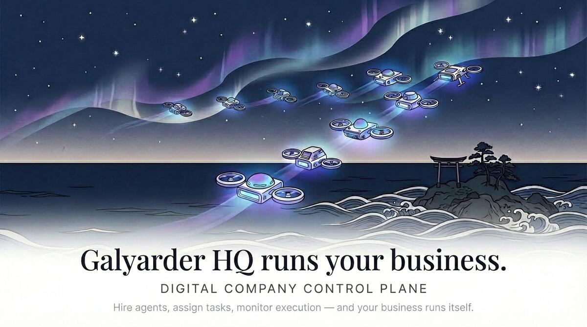

<p align="center">
  
</p>

<h1 align="center">Galyarder HQ</h1>

<p align="center">The control plane for AI-native companies.</p>

<p align="center">
  <a href="LICENSE"></a>
  <a href="https://github.com/galyarderlabs/galyarder-hq/stargazers"></a>
  <a href="https://github.com/galyarderlabs/galyarder-framework"></a>
</p>

<p align="center">
  Open source · Self-hosted · No account required
</p>

---

The next generation of companies won't be built by bigger teams. They'll be built by founders who figured out how to make AI work like a company — not just a tool.

Galyarder HQ is the infrastructure for that. A self-hosted control plane where you define the org, set the goals, and let agents run the operations. Not a chatbot. Not a workflow builder. A company — with structure, accountability, and 24/7 execution.

The shift is already happening. The question is whether you're running it, or still babysitting it.

---

## The idea

Most people use AI agents the same way they used to use Google — one question at a time. That's not leverage. That's just a faster keyboard.

Real leverage is when your agents have context, continuity, and coordination. When they know the company goal, not just the task. When they report to someone, not just to you. When they work while you sleep.

That's what Galyarder HQ is built for.

---

## How it works

You build an org. Departments, roles, reporting lines. You hire agents — Claude, Codex, Cursor, Gemini, or anything that speaks HTTP. You assign goals and let work flow down the hierarchy.

Agents wake on heartbeats. They check their queue, pick up tasks, execute, and report back. You review what matters. Everything else runs itself.

Every decision is logged. Every cost is tracked. Every agent has a budget. When they hit the limit, they stop. You're always in control — you just don't have to be present.

---

## What you get

**Structure, not chaos**  
Org charts. Departments. Reporting lines. Your agents have titles, managers, and a reason to exist beyond the last message you sent them.

**Continuity across sessions**  
Tasks are tickets. Conversations are threaded. Sessions persist. Your agents remember what they were doing — even after a reboot.

**Cost discipline**  
Monthly budgets per agent. Hard stops when limits are hit. You'll never wake up to a surprise bill again.

**Governance without micromanagement**  
Approval gates for what matters. Config versioning. Rollback. You set the rules once. The system enforces them.

**One control plane, many companies**  
Run multiple AI companies from a single deployment. Complete data isolation. One dashboard for your entire portfolio.

---

## Quickstart

```bash
git clone https://github.com/galyarderlabs/galyarder-hq.git
cd galyarder-hq
pnpm install
pnpm dev
```

Open **http://localhost:3100**

No database setup needed — uses embedded PGlite in dev.

**Requirements:** Node.js 20+, pnpm 9+

---

## Agent Framework

Galyarder HQ pairs with [Galyarder Framework](https://github.com/galyarderlabs/galyarder-framework) — 35 specialized agents and 132 production-ready skills for AI assistants.

Install Framework in your AI tool. Connect it to HQ. Your agents now have a company to work in.

---

## Supported agents

Claude Code · Codex · Cursor · Gemini · OpenCode · Any HTTP agent

If it can receive a heartbeat, it's hired.

---

## FAQ

**What does a typical setup look like?**  
A single Node.js process, an embedded database, and your agents. For production, point it at your own Postgres and deploy wherever you like. The agents handle the rest.

**Can I run multiple companies?**  
Yes. Unlimited companies, complete data isolation, one deployment.

**How is this different from just using Claude Code directly?**  
Claude Code does the work. Galyarder HQ runs the company that Claude Code works for. Org charts, budgets, goals, governance — the infrastructure that makes a team of agents actually function like a team.

**Do agents run continuously?**  
On heartbeats and event triggers by default. You bring the agent. HQ coordinates.

---

## Development

```bash
pnpm dev           # Start dev server (API + UI)
pnpm build         # Build everything
pnpm typecheck     # Type check
pnpm test:run      # Run tests
pnpm db:generate   # Generate migrations
pnpm db:migrate    # Apply migrations
```

Full guide: [doc/DEVELOPING.md](doc/DEVELOPING.md)

---

## Contributing

See [CONTRIBUTING.md](CONTRIBUTING.md).

---

## License

MIT © 2026 Galyarder Labs

---

<p align="center">
  The future of work isn't more people. It's better infrastructure.<br>
  <br>
  Open source. Self-hosted. Built for founders who think in systems.
</p>

- [CyMetica / EventTrader](https://cymetica.com) — The first agentically engineered financial platform. ~90% AI-authored codebase from inception, 10 autonomous trading agents, A2A protocol for agent-to-agent comms. Pre-launch TGE token price predictions on Base L2. Founder has 3 AI patents (USPTO). [Agent Card](https://cymetica.com/.well-known/agent.json) | [AI-Native Proof](https://cymetica.com/api/v1/ai-native/proof) | [TGE Markets](https://cymetica.com/tge-launch)
